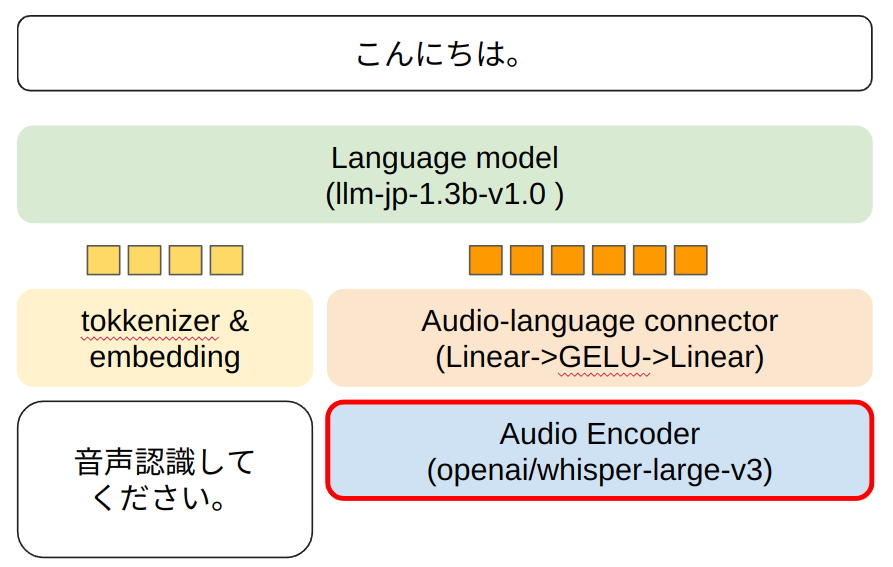

# llm-jp-asr
Whisperのデコーダを[llm-jp/llm-jp-1.3b-v1.0](https://huggingface.co/llm-jp/llm-jp-1.3b-v1.0)に置き換えた音声認識モデルを学習させるためのサンプルコードです。

[【音声認識コンペ】文学作品の音声を 文字起こししよう！📘🎧](https://competition.nishika.com/competitions/audio_book_transcription/summary)で使用するために作成したコードですので、必要に応じてコードは書き換えてください。

モデルの構造は[Enhancing Large Language Model-based Speech Recognition by Contextualization for Rare and Ambiguous Words, Nozawa, K., et al.(2024).](https://www.arxiv.org/abs/2408.08027)を参考に音声特徴量をLLMの入力として使えるように射影しています。



## 環境構築
```
poetry install
```

## 学習データのフォーマット
学習データのフォーマットは以下のようなCSVファイルを使用することを想定しています。

```:学習データサンプル
audio,sentence
音声データのPath1,正解ラベル1
音声データのPath2,正解ラベル2
・
・
・
```

> [!TIP]
> データのフォーマットを変更したい場合、llm_asr/train/dataset.pyのLazySupervisedDatasetを変更してください。

## 実行
### 学習
```
poetry run python train.py
```

> [!TIP]
> 起動引数についてはllm_asr/train/arguments_dataclass.pyを参考にしてください。

### 推論
```
poetry run python inference.py
```


